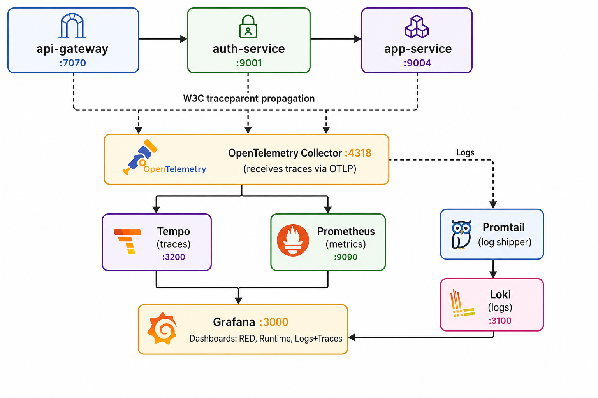

# Internal Observability Platform

Observability SDK and infrastructure for BRD NestJS microservices. One package gives every service structured logging, distributed tracing, Prometheus metrics, and health checks.

## Table of Contents

- [Repository structure](#repository-structure)
- [What the SDK provides](#what-the-sdk-provides)
- [Quick start](#quick-start)
- [Architecture](#architecture)
- [Sandbox (local observability stack)](#sandbox-local-observability-stack)
  - [Pre-built Grafana dashboards](#pre-built-grafana-dashboards)
  - [Signal correlation](#signal-correlation)
  - [Alerting](#alerting)
  - [Piping service logs to Loki](#piping-service-logs-to-loki)
- [Integrated services](#integrated-services-used-as-a-test-basis)
- [Installation](#installation)
- [Documentation](#documentation)
- [Contributing](#contributing)

## Repository structure

```
├── packages/sdk/          # @brdrwanda/observability npm package
│   ├── src/               # SDK source code
│   ├── README.md          # Full developer guide (setup, configuration, examples)
│   └── package.json
└── sandbox/               # Local observability stack (docker-compose)
    ├── grafana/            # Dashboards + datasource provisioning
    ├── otel-collector/     # OpenTelemetry Collector config
    ├── promtail/           # Log shipping to Loki
    ├── docker-compose.yml
    ├── prometheus.yml
    └── tempo.yaml
```

## What the SDK provides

| Capability | What happens | Your effort |
|------------|-------------|-------------|
| Structured JSON logs | Every log has `trace_id`, `request_id`, `span_id`, `service_name` | Zero — automatic |
| Request lifecycle | `request_started` / `request_completed` with duration | Zero — automatic |
| Error classification | 401→`authentication_failed`, 400→`validation_failed`, 500→`server_error` | Zero — automatic |
| HTTP metrics | `http_requests_total`, `http_request_duration_seconds` | Zero — automatic |
| Node.js metrics | CPU, memory, event loop, GC | Zero — automatic |
| Health checks | `/health` endpoint | Zero — automatic |
| Distributed tracing | W3C `traceparent` propagation across services | One line: `propagation.inject()` |
| Custom spans | Trace business logic and external API calls | One decorator: `@Span('name')` |
| Database tracing | Sequelize query logging with slow query alerts | One config line |
| Kafka tracing | Trace context across Kafka produce/consume | `kafkaInstrumentation()` |
| Sensitive data redaction | Passwords, tokens, keys auto-censored | Zero — automatic |
| Metric exemplars | Histogram observations carry `trace_id` — click a latency spike to see the trace | Zero — automatic |

## Quick start

```bash
npm install @brdrwanda/observability
```

```typescript
// app.module.ts
import { ObservabilityModule, ObservabilityHealthModule, httpInstrumentation } from '@brdrwanda/observability';

@Module({
  imports: [
    ObservabilityModule.forRoot({
      serviceName: 'my-service',
      tracing: { exporter: { type: 'otlp-http', endpoint: 'http://localhost:4318' } },
      instrumentations: [httpInstrumentation()],
    }),
    ObservabilityHealthModule,
  ],
})
export class AppModule {}
```

```typescript
// main.ts
import { setupProcessErrorHandlers, NestPinoLogger } from '@brdrwanda/observability';

setupProcessErrorHandlers({ serviceName: 'my-service' });

const app = await NestFactory.create(AppModule, { bufferLogs: true });
app.useLogger(app.get(NestPinoLogger));
// Do NOT add app.useGlobalFilters() — SDK handles this automatically
```

**Full setup guide, configuration reference, and examples:** [packages/sdk/README.md](packages/sdk/README.md)

## Architecture




## Sandbox (local observability stack)

Run the full Grafana + Prometheus + Loki + Tempo stack locally:

```bash
cd sandbox
docker compose up -d
```

| Tool | URL | Purpose |
|------|-----|---------|
| Grafana | http://localhost:3000 | Dashboards, log search, trace viewer |
| Prometheus | http://localhost:9090 | Metrics queries |
| Tempo | http://localhost:3200 | Trace storage |
| Loki | http://localhost:3100 | Log storage |

### Pre-built Grafana dashboards

| Dashboard | What it shows |
|-----------|--------------|
| **Service Overview (RED)** | Request rate, error rate, response time percentiles, status codes, slowest routes |
| **Node.js Runtime** | Heap memory, CPU usage, event loop lag, GC duration, active handles |
| **Logs & Traces** | Log volume by level, warnings/errors, recent traces, all logs |

### Signal correlation

All three signals (metrics, logs, traces) are linked bidirectionally in Grafana:

| From | To | How |
|------|----|-----|
| **Metrics → Traces** | Click exemplar dot on a graph | Histogram carries `trace_id` as exemplar label |
| **Traces → Logs** | "Logs for this trace" button in Tempo | Loki query filtered by `trace_id` |
| **Logs → Traces** | Click `trace_id` in a log line | Derived field links to Tempo |
| **Traces → Metrics** | "Request rate" / "Error rate" / "p95" links | Tempo trace-to-metrics queries |

### Alerting

**Prometheus alerts** (metrics-based) — evaluated every 15s:

| Alert | Condition | Severity |
|-------|-----------|----------|
| ServiceDown | `up == 0` for 1min | critical |
| HighErrorRate | 5xx > 5% for 5min | critical |
| HighLatencyP95 | p95 > 2s for 5min | warning |
| HighLatencyP99 | p99 > 5s for 5min | critical |
| HighMemoryUsage | heap > 85% for 10min | warning |
| HighEventLoopLag | lag > 500ms for 5min | warning |

**Grafana alerts** (log-based) — evaluated every 1min:

| Alert | Condition | Severity |
|-------|-----------|----------|
| Error Log Spike | error rate > 0.5/sec for 5min | warning |
| Auth Failure Spike | auth failures > 1/sec for 5min | warning |
| Service Stopped Logging | no logs for 10min | critical |

Alerts are sent to Microsoft Teams via incoming webhook.

### Piping service logs to Loki 

Promtail watches `/tmp/observability-logs/*.log` (Locally). Start services with:

```bash
NODE_ENV=production npm start 2>&1 | tee /tmp/observability-logs/my-service.log
```
If your services run in Docker containers Grafana's Loki Docker logging drivers sends container stdout directly to loki - no files needed

If your running your services using pm2, it will write files stdout/stderr at ```.pm2/logs```. 

## Integrated services (Used as a test basis)

| Service | Port | Status |
|---------|------|--------|
| api-gateway | 7070 | SDK integrated |
| authentication-service | 9001 | SDK integrated |
| application-service | 9004 | SDK integrated + external API spans |
| access-management-service | 9000 | SDK integrated |

## Installation

Published on npm under the `@brdrwanda` org. No token or `.npmrc` needed.

```bash
npm install @brdrwanda/observability
```

## Documentation

| Document | What's in it |
|----------|-------------|
| [SDK README](packages/sdk/README.md) | Full developer guide: setup, configuration, logging, tracing, spans, Kafka, migration, reference |
| [SDK CHANGELOG](packages/sdk/CHANGELOG.md) | Version history |

## Contributing

```bash
# Install dependencies
pnpm install

# Build SDK
cd packages/sdk && pnpm build

# Run tests
pnpm test

# Start sandbox
cd sandbox && docker compose up -d
```
